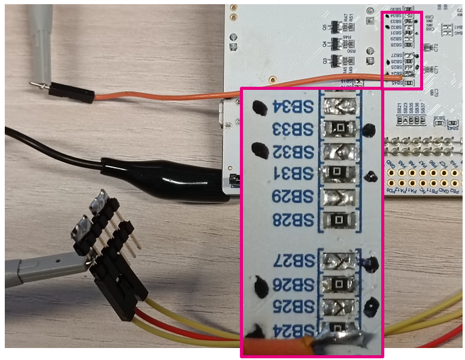

# Cheat sheet for LPTIMx Hands on - PART 3
configure LPUART1 a LPDMA to send measured data:<br>

- send only valid bytes<br>
  
- switch CORE to STOP2 mode<br> 

For proper application settings is neccessary follow the presentation, where all settings are mentioned.

## Connection

SB34 -> SB33<br>
SB32 -> SB31<br>
SB27 -> SB26<br>
**SB25 -> SB24**<br>
Here is connected an osciloscoppe to TX signal



## Settings for Linked-list queue for IC2 EVENT - LpUart1Node1

General - Name

```c
LpUart1Node1
```

Runtime configuration - Source adress

```c
(uint32_t)RisingEdge
```

Runtime configuration - Destination adress

```c
(uint32_t)&((*LPUART1).TDR)
```

Runtime configuration - Data size

```c
2
```

## Settings for Linked-list queue for IC2 EVENT - LpUart1Node2

General - Name

```c
LpUart1Node2
```

Runtime configuration - Source adress

```c
(uint32_t)&(RisingEdge[1])
```

Runtime configuration - Destination adress

```c
(uint32_t)&((*LPUART1).TDR)
```

Runtime configuration - Data size

```c
2
```

## Settings for Linked-list queue for IC2 EVENT - LpUart1Node3

General - Name

```c
(uint32_t)&FallingEdge
```

Runtime configuration - Source adress

```c
(uint32_t)RisingEdge
```

Runtime configuration - Destination adress

```c
(uint32_t)&((*LPUART1).TDR)
```

Runtime configuration - Data size

```c
2
```

## Modify linked_list.c

```c
DMA_NodeTypeDef Ccr1Node __attribute__ ((section (".sram4")));
DMA_QListTypeDef LpTim1_Queue __attribute__ ((section (".sram4")));
DMA_NodeTypeDef ArrNode __attribute__ ((section (".sram4")));
DMA_QListTypeDef LpTim1Arr_Queue __attribute__ ((section (".sram4")));
DMA_NodeTypeDef Ic1Node __attribute__ ((section (".sram4")));
DMA_QListTypeDef LpTim3Ic1_Queue __attribute__ ((section (".sram4")));
DMA_NodeTypeDef Ic2Node1 __attribute__ ((section (".sram4")));
DMA_QListTypeDef LpTim3Ic2_Queue __attribute__ ((section (".sram4")));
DMA_NodeTypeDef Ic2Node2 __attribute__ ((section (".sram4")));
DMA_NodeTypeDef LpUart1Node1 __attribute__ ((section (".sram4")));
DMA_NodeTypeDef LpUart1Node2 __attribute__ ((section (".sram4")));
DMA_NodeTypeDef LpUart1Node3 __attribute__ ((section (".sram4")));
```

## Modify main.c

Add this code to **USER CODE 2** section between LPTIM1 and LPTIM 3 initializations<br>


```c
// LPUART1 will be controlled by DMA,
// therefore we enable it by direct register access
(*LPUART1).CR3 |= USART_CR3_DMAT;
__HAL_UART_ENABLE(&hlpuart1);
```

Add this code to the end of **USER CODE 2** section<br>


```c
//Enable all used peripherals as autonomous
//in STOP mode and enter STOP2 mode
(*RCC).SRDAMR |= (RCC_SRDAMR_SRAM4AMEN | RCC_SRDAMR_LPDMA1AMEN \
              | RCC_SRDAMR_LPTIM1AMEN | RCC_SRDAMR_LPTIM3AMEN \
              | RCC_SRDAMR_LPUART1AMEN);

HAL_SuspendTick();
HAL_PWREx_EnterSTOP2Mode(PWR_STOPENTRY_WFI);
```
